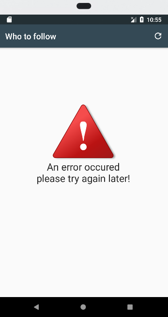

# GIT CLIENT

A simple Kotlin git client project to demonstrate reactive programming in RxKotlin
Follows Uncle Bobs Clean Architecture and uses Android Architectural Components (AAC)
Architecture used is MVVM

## Getting Started

Git clone or download zip file to continue
### Prerequisites

Android Studio 3.0 and and above

## Libraries used

* [Koin](https://insert-koin.io/) - Android dependency management
* [Retrofit2](http://square.github.io/retrofit/) - For consuming REST API
* [Android Architectural Components](https://developer.android.com/topic/libraries/architecture/) - ViewModel and LiveData
* [RxKotlin](https://github.com/ReactiveX/RxKotlin) - Implementation of Reactive programming in Kotlin
* [AndroidX](https://developer.android.com/jetpack/) - Project is based on Jetpack

    
